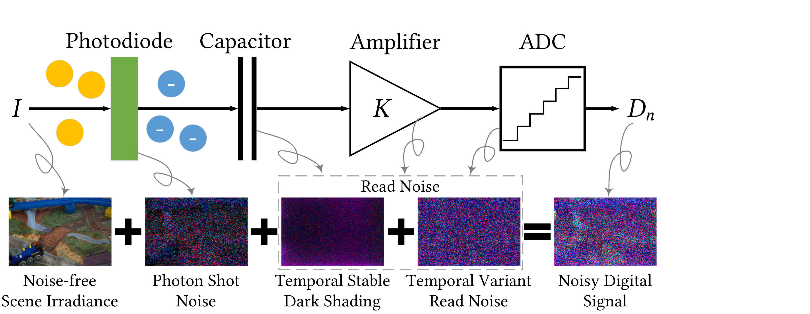
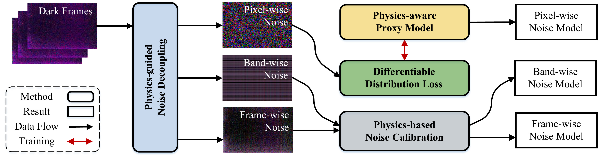
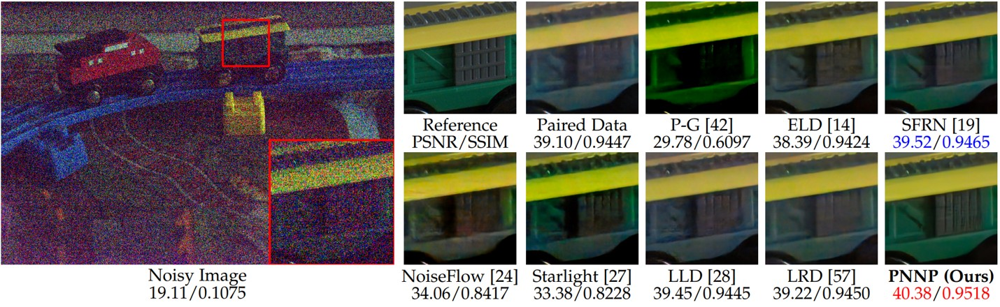

# PNNP
[English](README.md) | [中文](README_CN.md)

**[Paper (IEEE TPAMI)](https://ieeexplore.ieee.org/document/11342300)** | **[arXiv](https://arxiv.org/abs/2310.09126)** | **[LRID Dataset (Hugging Face)](https://huggingface.co/datasets/hansen97/LRID)** | **[Checkpoints & Resources (Baidu Netdisk)](https://pan.baidu.com/s/1WMv2x7yqg0kMTBCddqkCLQ?pwd=vmcl)**

IEEE TPAMI 2026: [Learning Physics-Informed Noise Models from Dark Frames for Low-Light Raw Image Denoising](https://ieeexplore.ieee.org/document/11342300)  

Arxiv (Old Name): [Physics-guided Noise Neural Proxy for Practical Low-light Raw Image Denoising](https://arxiv.org/abs/2310.09126)

## 🎉 News
* **(2026.04)** 🎉 Our paper was published in *IEEE Transactions on Pattern Analysis and Machine Intelligence* (Vol. 48, No. 4, pp. 3952-3969).
* **(2026.03)** 🗃️ The LRID dataset was released on Hugging Face: [hansen97/LRID](https://huggingface.co/datasets/hansen97/LRID) (full version) and [hansen97/LRID_simplified](https://huggingface.co/datasets/hansen97/LRID_simplified) (simplified version for quick validation).
* **(2023.10)** 📰 The preprint was released on arXiv.

## ✨ Highlights
* **Learning noise models from dark frames.** We propose to learn the sensor noise model from dark frames instead of paired real data, breaking the data dependency of learning-based noise modeling.
* **Physics-guided noise decoupling (PND).** Dark-frame noise is decoupled into frame-wise, band-wise, and pixel-wise components. The known frame-wise and band-wise components are handled by physics-based calibration, which reduces the complexity of noise modeling.
* **Physics-aware proxy model (PPM).** A lightweight neural proxy with spatially independent $1\times1$ convolutions and ISO-dependent/ISO-agnostic branches models the remaining i.i.d. pixel-wise noise, constrained by physical priors to promote the accuracy of noise modeling.
* **Differentiable distribution loss (DDL).** Differentiable quantile and CDF losses provide explicit and reliable supervision of the noise distribution, promoting the precision of noise modeling.

## 📦 Code Release
This repository provides evaluation code, released PNNP weights for Sony A7S2 and IMX686, and the denoising training code that uses these weights to synthesize noise. The training code for PNNP itself is not included.

## 📖 Introduction
The raw sensor noise model can be written as

$$N = K N_p + N_{indep},$$

where the signal-dependent photon shot noise $N_p$ can be modeled reliably with a Poisson distribution, while the signal-independent noise $N_{indep}$ is more difficult to describe. PNNP learns this part from dark frames instead of paired clean/noisy images.



PNNP first decouples the dark-frame noise into frame-wise, band-wise, and pixel-wise components. The known frame-wise and band-wise components are modeled with physics-based calibration, while a lightweight physics-aware neural proxy models the remaining i.i.d. pixel-wise noise. The proxy uses spatially independent $1\times1$ convolutions and ISO-dependent/ISO-agnostic branches, and is trained with differentiable quantile and CDF losses. The released weights are used together with shot noise and other calibrated physical components to synthesize training data for downstream raw denoising networks.



The supported comparison methods currently include:

1. Paired Data (baseline)
2. P-G
3. ELD
4. SFRN
5. NoiseFlow
6. PMN (MM/TPAMI)

We will provide support for additional comparative methods in the future.

## 📋 Prerequisites
* Python >= 3.6, PyTorch >= 1.6
* Requirements: opencv-python, rawpy, exifread, h5py, scipy
* Platforms: Ubuntu 16.04, CUDA 10.1
* Our method can run on the CPU, but we recommend running it on a GPU

## 🗃️ Datasets & Resources
Please download the datasets required for evaluation or training first.

### Datasets
* **ELD** ([official project](https://github.com/Vandermode/ELD)): [download (11.46 GB)](https://drive.google.com/file/d/13Ge6-FY9RMPrvGiPvw7O4KS3LNfUXqEX/view?usp=sharing)
* **SID** ([official project](https://github.com/cchen156/Learning-to-See-in-the-Dark)): [download (25 GB)](https://storage.googleapis.com/isl-datasets/SID/Sony.zip)
* **LRID** ([official project](https://fenghansen.github.io/publication/PMN/)): the low-light raw image denoising dataset collected with an IMX686 smartphone camera in our previous work [PMN](https://github.com/megvii-research/PMN/tree/TPAMI) (ACM MM 2022 / IEEE TPAMI 2024). It is used in this repository for training and evaluation on the IMX686 camera.
  * **Baidu Netdisk**: [download](https://pan.baidu.com/s/1fXlb-Q_ofHOtVOufe5cwDg?pwd=vmcl), including LRID_raw (523 GB, all data), LRID (185.1 GB, for training), results (19.92 GB, PMN visual results), and metrics (59 KB, pkl files). **Downloading LRID (185.1 GB) is sufficient for training.**
  * **Hugging Face**: [hansen97/LRID](https://huggingface.co/datasets/hansen97/LRID) hosts the full LRID dataset (all raw data, including dark frames, reference frames, and intermediate results), while [hansen97/LRID_simplified](https://huggingface.co/datasets/hansen97/LRID_simplified) keeps one noisy frame per scene together with all ground truths and dark frames, which is intended for quick validation rather than full training.

### Dark Frames
PNNP learns the noise model from dark frames, which are required to calibrate or learn the noise model of a new camera:
* **IMX686**: dark frames are already included in the LRID dataset (`bias/` and `bias-hot/`).
* **Sony A7S2**: we recommend the dark frames from the **LLD dataset** ([official project](https://github.com/happycaoyue/LLD); CVPR 2023, *Physics-Guided ISO-Dependent Sensor Noise Modeling for Extreme Low-Light Photography*), which provides dark (bias) frames captured by a Sony A7S2 across a wide range of ISO settings: [download (Baidu Netdisk)](https://pan.baidu.com/s/1eLKzjOSDCR4NNLcvbyenEQ?pwd=WAXY). If you use these dark frames, please also cite the LLD paper (see [Citation](#citation)).

### Checkpoints, Camera Resources & rawpy Templates
The latest checkpoints, camera resources, denoising samples, and the two rawpy templates are available at [Baidu Netdisk](https://pan.baidu.com/s/1WMv2x7yqg0kMTBCddqkCLQ?pwd=vmcl). Place `checkpoints` in the project root and arrange the camera resources according to `ReadMe.txt` in the archive. If you use different directories, update the corresponding paths in `runfiles/$camera_type$/$method$.yml`.

Raw visualization requires both template files. Place them directly in the project root:

```text
PNNP/
├── templet.ARW    # Sony A7S2
└── templet.dng    # IMX686
```

They only provide the RAW metadata used by rawpy to generate RGB images; training and evaluation with image saving enabled will load them automatically.

## 🎬 Quick Start
### 1. Generate dataset infos
Use `get_dataset_infos.py` to generate dataset information files (modify `--root_dir` as needed).

```bash
# Evaluate
python3 get_dataset_infos.py --dstname ELD --root_dir /data/ELD --mode SonyA7S2
python3 get_dataset_infos.py --dstname SID --root_dir /data/SID/Sony --mode evaltest
python3 get_dataset_infos.py --dstname LRID --root_dir /data/LRID

# Train
python3 get_dataset_infos.py --dstname SID --root_dir /data/SID/Sony --mode train
python3 get_dataset_infos.py --dstname LRID --root_dir /data/LRID
```

### 2. Evaluation
You can replace PNNP with another method name. We currently provide the weights of P-G, ELD, SFRN, NoiseFlow, LRD, and PMN.

```bash
# ELD & SID
python3 trainer_SID.py -f runfiles/SonyA7S2/PNNP.yml --mode evaltest
# ELD only
python3 trainer_SID.py -f runfiles/SonyA7S2/PNNP.yml --mode eval
# SID only
python3 trainer_SID.py -f runfiles/SonyA7S2/PNNP.yml --mode test
# LRID
python3 trainer_LRID.py -f runfiles/IMX686/PNNP.yml --mode evaltest
```

If you do not want to save images, add `--save_plot False` to save time and disk space.

### 3. Training
The paper settings use two consecutive stages for each camera. Run stage 1 first, then stage 2; stage 2 resumes the model with the same `model_name` from epoch 600 and trains to epoch 1000.

```bash
# Sony A7S2 / SID
bash scripts/train_paper_sony.sh

# IMX686 / LRID
bash scripts/train_paper_imx686.sh
```

Set the GPU before running a script if needed, for example:

```bash
bash scripts/train_paper_sony.sh 0
```

The equivalent entrypoints and runfiles are `trainer_PNNP_SID.py` with `runfiles/SonyA7S2/PNNP_paper_stage{1,2}.yml`, and `trainer_PNNP_LRID.py` with `runfiles/IMX686/PNNP_paper_stage{1,2}.yml`.

## 📄 Results
Visual comparison on the SID dataset (Sony A7S2). The numbers below each method are PSNR/SSIM.



## 🏷️ Citation
Please cite our paper if you find our code helpful in your research or work.

```bibtex
@article{feng2026learning,
  author={Feng, Hansen and Wang, Lizhi and Huang, Yiqi and Wang, Yuzhi and Zhu, Lin and Huang, Hua},
  journal={IEEE Transactions on Pattern Analysis and Machine Intelligence},
  title={Learning Physics-Informed Noise Models from Dark Frames for Low-Light Raw Image Denoising},
  year={2026},
  volume={48},
  number={4},
  pages={3952-3969}
}
```

If you use the LRID dataset or the LLD dark frames, please also cite the corresponding papers:

```bibtex
@inproceedings{feng2022learnability,
  author={Feng, Hansen and Wang, Lizhi and Wang, Yuzhi and Huang, Hua},
  title={Learnability Enhancement for Low-Light Raw Denoising: Where Paired Real Data Meets Noise Modeling},
  booktitle={Proceedings of the 30th ACM International Conference on Multimedia},
  year={2022},
  pages={1436--1444},
  numpages={9},
  location={Lisboa, Portugal},
  series={MM '22}
}

@article{feng2023learnability,
  author={Feng, Hansen and Wang, Lizhi and Wang, Yuzhi and Fan, Haoqiang and Huang, Hua},
  journal={IEEE Transactions on Pattern Analysis and Machine Intelligence},
  title={Learnability Enhancement for Low-Light Raw Image Denoising: A Data Perspective},
  year={2024},
  volume={46},
  number={1},
  pages={370-387},
  doi={10.1109/TPAMI.2023.3301502}
}

@inproceedings{cao2023physics,
  author={Cao, Yue and Liu, Ming and Liu, Shuai and Wang, Xiaotao and Lei, Lei and Zuo, Wangmeng},
  title={Physics-Guided ISO-Dependent Sensor Noise Modeling for Extreme Low-Light Photography},
  booktitle={Proceedings of the IEEE/CVF Conference on Computer Vision and Pattern Recognition (CVPR)},
  month={June},
  year={2023},
  pages={5744-5753}
}
```

## 📧 Contact
If you would like to get in-depth help, please contact me at fenghansen@bit.edu.cn or hansen97@outlook.com with a brief self-introduction including your name, affiliation, and position.
